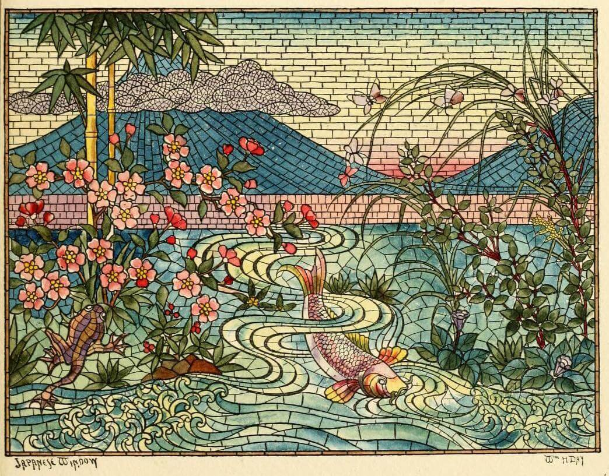
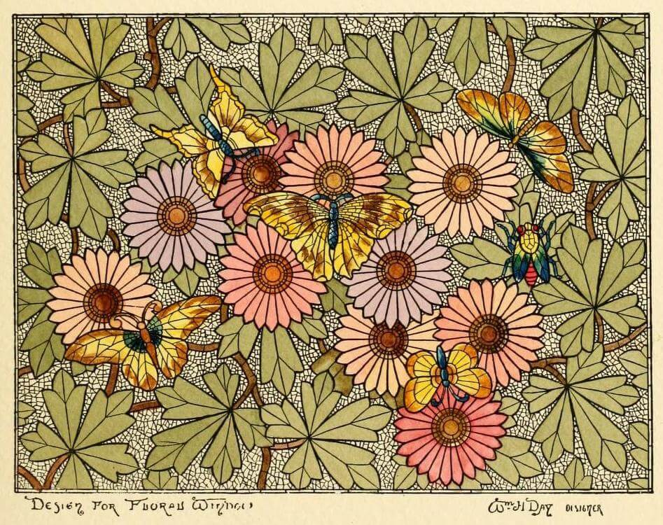

  
  

Hi, I'm Dan. Welcome to my digital garden.

## About me

I'm a self-taught software developer from the Netherlands. My background is in aviation, but I decided to make a career switch from commercial pilot to developer in 2012. Currently I'm working at [Framer](https://www.framer.com/) as a backend engineer, where I help build and scale the global hosting backend and infrastructure.

Besides coding and airplanes, I also like reading books (especially fantasy), eating delicious pastries, salsa dancing (I'm not very good, but it helps burn off all those pastries) and riding my bike (I mean bicycle, but bike sounds cooler).

## Digital garden?

A digital garden is a way to publish personal knowledge on the web. It sits somewhere between a collection of personal notes (messy, topological) and a personal blog (polished, chronological).

  
  
  
  

The main goal of a digital garden is to collect, grow and evolve ideas over time. It's about making connections, learning in public and having a personal space that reflects your way of thinking. What makes it unique though, is that **a digital garden has unfinished and imperfect work**.

You can read more about digital gardens here: <https://maggieappleton.com/garden-history>

## Why I garden

I like the idea of a digital garden, because it:

1. Represents continuous learning and growth.
2. Embraces imperfection.

Regarding point 1, I enjoy learning (more) about topics related to software engineering and computer science. So a large part of my garden will be about that.

And regarding point 2, I'm curious to try out the more messy and chaotic nature of a digital garden. Because I find that (regularly) posting on a personal blog doesn't really work for me: I end up with a lot of drafts and don't publishing much, because I feel it's not good enough.

  
  
  

## How I garden

My garden contains work in different stages, and I'm using the following tags to make the status more clear:

- [[tags/seedling]] for work that's (very) rough and early stage.
- [[tags/sapling]] for work that's starting to take shape, but is not complete yet.
- [[tags/evergreen]] for work I feel is reasonably complete.

But because a garden is never finished, work contains **planted** and **last tended** dates to show how long it's been growing.

> [!info] About this site
> The color theme is [Rosé Pine](https://rosepinetheme.com/palette/), illustrations (public domain) are from [Public Work](https://public.work/) and the code is on my [GitHub](https://github.com/danillouz/dans.garden).
